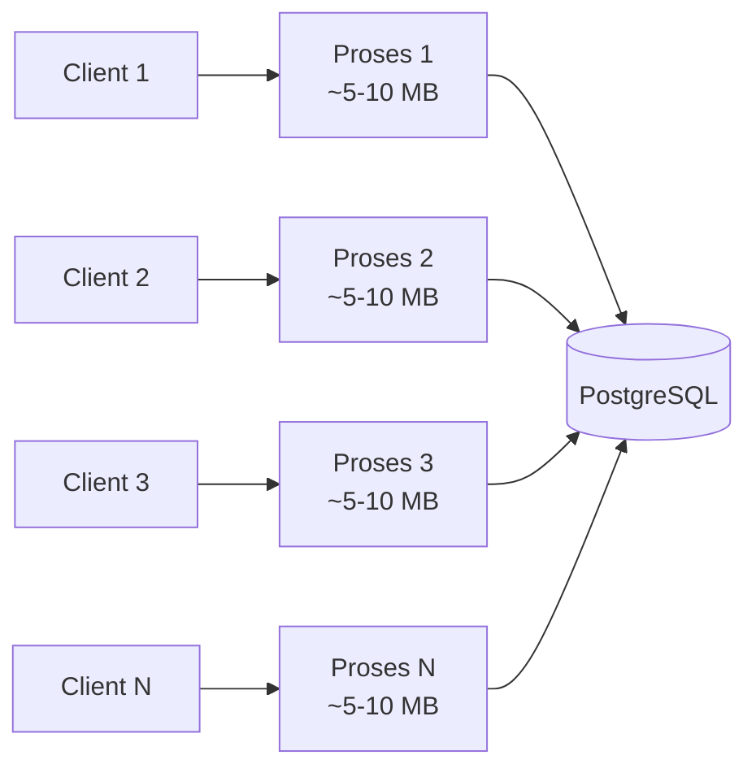
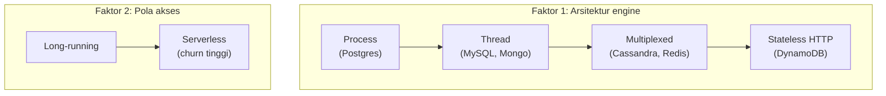
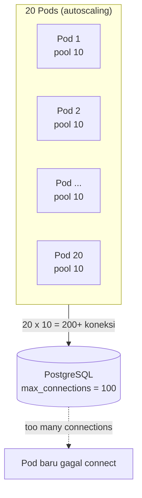
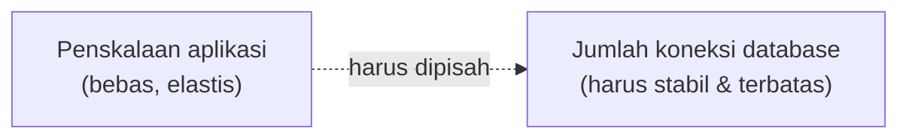
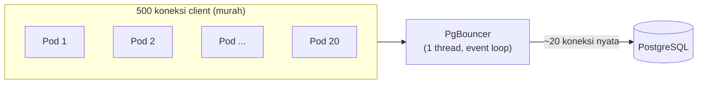
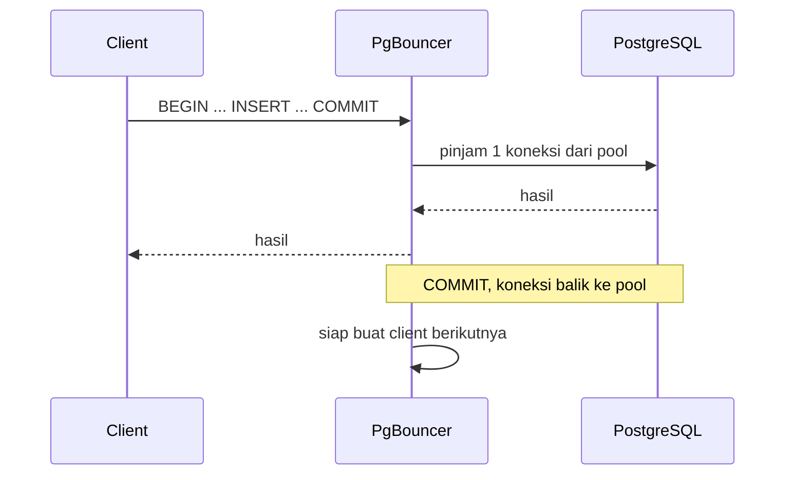
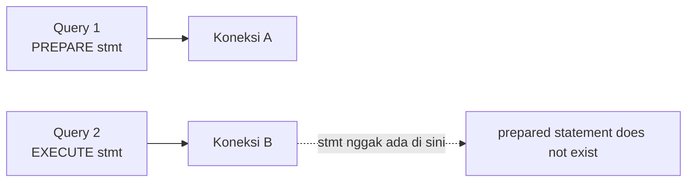
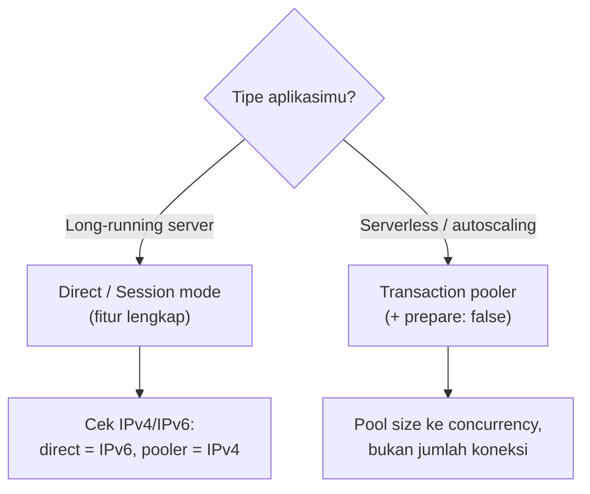

<!-- ============================================================
  MATERI SHARING SESSION — FORMAT PER SLIDE
  Tiap blok di antara penanda <!-- SLIDE N --> adalah satu slide.
  Teks di dalam <!-- Catatan: ... --> adalah catatan pembicara,
  tidak muncul di slide.
============================================================ -->


<!-- ===================== SLIDE 1 ===================== -->

# Kenapa Koneksi PostgreSQL Itu Mahal

### Dan gimana PgBouncer ngatasinnya pas aplikasi di-scale

Sharing session · *berangkat dari satu bug yang bikin pusing*

<!-- Catatan: Buka santai. Bilang materi ini lahir dari kasus nyata: bug yang awalnya kelihatan sepele tapi ujungnya nyambung ke arsitektur koneksi database. -->

---

<!-- ===================== SLIDE 2 ===================== -->

# Berawal dari satu bug

Di halaman create:

- `INSERT` sukses
- Data ke-return lengkap sama `id`-nya
- Halaman detail → datanya nggak ada
- Cek ke database → memang nggak ada

**Dan intermittent. Kadang masuk, kadang nggak.**

<!-- Catatan: Tekankan: nggak ada error, nggak ada exception, kodenya udah bener. Lempar pertanyaan ke audiens "kira-kira datanya ke mana?" — biarkan menggantung. Jawabannya ada di lapisan koneksi, dan kita bahas dari akarnya dulu. -->

---

<!-- ===================== SLIDE 3 ===================== -->

# Agenda

1. Kenapa koneksi PostgreSQL mahal
2. Ini cuma masalah Postgres atau enggak?
3. Jebakannya pas aplikasi scale-out
4. Cara kerja PgBouncer
5. Konsekuensinya — dan bug di awal terjawab
6. Ringkasan praktis

---

<!-- ===================== SLIDE 4 ===================== -->

# Bagian 1

## Kenapa satu koneksi PostgreSQL itu "mahal"?

---

<!-- ===================== SLIDE 5 ===================== -->

# Process-per-connection



- Tiap koneksi = satu proses OS
- Makan beberapa MB RAM + overhead context-switching
- `max_connections` default cuma **100**

<!-- Catatan: Poin kunci: di Postgres satu koneksi bukan sekadar socket, tapi proses penuh hasil fork. Itu sebabnya plafonnya rendah dan koneksi terasa mahal. -->

---

<!-- ===================== SLIDE 6 ===================== -->

# Bagian 2

## Ini cuma masalah PostgreSQL?

---

<!-- ===================== SLIDE 7 ===================== -->

# Tergantung model koneksinya

| Database | Model koneksi | Biaya | Butuh pooler? |
|---|---|---|---|
| **PostgreSQL** | Process-per-connection | Mahal | Sangat perlu |
| **MySQL** | Thread-per-connection | Sedang | Perlu di skala besar |
| **MongoDB** | Thread + pool di driver | Sedang | Otomatis di driver |
| **Cassandra / Scylla** | Async multiplexed | Murah | Enggak |
| **Redis** | Single-thread event loop | Murah | Opsional |
| **DynamoDB / Firestore** | Stateless HTTP | Nggak ada koneksi persisten | Nggak relevan |

<!-- Catatan: Pesan utamanya: yang nentuin bukan SQL vs NoSQL, tapi model koneksi. Tunjuk Cassandra & DynamoDB sebagai contoh yang "lolos" by design. -->

---

<!-- ===================== SLIDE 8 ===================== -->

# Dua hal yang menentukan



- Faktor 1 → seberapa mahal *satu* koneksi
- Faktor 2 → *seberapa banyak* koneksi dibuka-tutup

<!-- Catatan: Postgres kena di faktor 1. Serverless bikin faktor 2 makin parah. Kombinasi keduanya = kasus paling berat. -->

---

<!-- ===================== SLIDE 9 ===================== -->

# Bagian 3

## Jebakannya pas aplikasi scale-out

---

<!-- ===================== SLIDE 10 ===================== -->

# Hitungan yang menjebak



- 20 pod × 10 = 200 koneksi → lewat plafon
- Spike lebih gede → 500 → 1000...

<!-- Catatan: Tekankan ironinya: pas trafik tinggi, autoscaling malah memperburuk — makin banyak pod yang naik, makin banyak yang gagal connect. -->

---

<!-- ===================== SLIDE 11 ===================== -->

# Akar masalahnya: elastisitas

Pool kecil per-pod nggak nyelesain masalah — pengalinya (jumlah pod) elastis.



Kita butuh sesuatu yang **memisahkan** keduanya.

---

<!-- ===================== SLIDE 12 ===================== -->

# Bagian 4

## Solusinya: PgBouncer

---

<!-- ===================== SLIDE 13 ===================== -->

# Idenya



**Banyak koneksi murah di depan → sedikit koneksi mahal di belakang.**

<!-- Catatan: Semua app nyambung ke pooler, bukan langsung ke database. -->

---

<!-- ===================== SLIDE 14 ===================== -->

# "Kok sanggup pegang 500 koneksi?"

PgBouncer **nggak pakai thread/proses per koneksi.**

- Single-threaded, pakai **event loop** (sama kayak nginx & Redis)
- Koneksi ke PgBouncer = socket + buffer kecil (KB-an)
- Satu thread layani semua koneksi
- Ribuan koneksi idle ≈ nyaris gratis

<!-- Catatan: Bandingkan dengan koneksi ke Postgres yang tiap satunya proses ~MB. Ini menjawab paradoks "kalau koneksi mahal kok poolernya kuat". -->

---

<!-- ===================== SLIDE 15 ===================== -->

# Cara dia bagi-bagi koneksi



- Sisi depan: banyak koneksi client (idle)
- Sisi belakang: sedikit koneksi nyata, dipakai ulang
- Pool penuh → request **ngantri**, bukan error

<!-- Catatan: Bonus: koneksi server dipakai ulang, jadi hemat biaya fork proses + handshake auth tiap request. -->

---

<!-- ===================== SLIDE 16 ===================== -->

# Tiga mode pooling

| Mode | Koneksi dipinjam selama... | Multiplexing |
|---|---|---|
| **Session** | seluruh sesi client | Rendah |
| **Transaction** | satu transaksi | **Tinggi** |
| **Statement** | satu statement | Paling agresif |

Aturan main: **pool size disetel ke concurrency, bukan ke jumlah koneksi client.**

<!-- Catatan: Di transaction mode-lah multiplexing benar-benar kerja: 500 client berbagi ~20 koneksi server, karena pada satu waktu cuma sedikit yang benar-benar lagi transaksi. Session mode = fitur lengkap tapi multiplexing rendah. -->

---

<!-- ===================== SLIDE 17 ===================== -->

# Bagian 5

## Ada harganya

---

<!-- ===================== SLIDE 18 ===================== -->

# Harga dari transaction mode

Koneksi gonta-ganti antar client → state level-koneksi rusak:



- Prepared statement, temp table, `SET`, advisory lock
- Asumsi "satu sesi = satu koneksi fisik"

---

<!-- ===================== SLIDE 19 ===================== -->

# Balik ke bug di awal

- Driver ngaktifin **prepared statement** secara default
- Lewat transaction pooler (6543) yang nggak mendukungnya
- Koneksi gonta-ganti → stmt nggak ketemu → commit gagal diam-diam
- `RETURNING` sempat balik data **sebelum** commit gagal → keliatan sukses

```ts
const client = postgres(DATABASE_URL, { prepare: false })
```

**Bug-nya bukan di kode, tapi di asumsi soal koneksi.**

<!-- Catatan: Ini momen "klik"-nya. Kasih jeda sebentar sebelum nunjukin fix satu baris ini. -->

---

<!-- ===================== SLIDE 20 ===================== -->

# PgBouncer vs Supavisor

| | **PgBouncer** | **Supavisor** |
|---|---|---|
| Bahasa | C | Elixir (BEAM) |
| Concurrency | Single-thread event loop | Banyak proses ringan + multicore |
| Multicore | Banyak instance (`so_reuseport`) | Natural ke banyak core |
| Cocok buat | Co-located, low latency | Multi-tenant, cloud-native |

Konsep intinya identik: banyak di depan, sedikit di belakang.

<!-- Catatan: Supavisor itu pooler-nya Supabase. Kalau audiens pakai Supabase, port 5432 = session mode, 6543 = transaction mode dari Supavisor yang sama. -->

---

<!-- ===================== SLIDE 21 ===================== -->

# Bagian 6

## Ringkasan praktis

---

<!-- ===================== SLIDE 22 ===================== -->

# Cara milih jenis koneksi



---

<!-- ===================== SLIDE 23 ===================== -->

# Checklist

- Cek dulu apakah pool di app kebesaran (~`core × 2`, sering ~10)
- Long-running → direct / session mode
- Serverless / autoscaling → transaction pooler + `prepare: false`
- Pooler harus **terpusat**, bukan sidecar per-pod
- Pooler nyelesain masalah *koneksi*, bukan *throughput*
- Throughput mentok → replica, caching, instance lebih gede, sharding

---

<!-- ===================== SLIDE 24 ===================== -->

# Penutup

Pooler **memisahkan penskalaan aplikasi dari jumlah koneksi database.**

App boleh scale sebebasnya — koneksi ke Postgres tetap datar dan terkendali.

*Dan bug intermittent tadi cuma versi mini dari persoalan yang sama saat scale.*

---

<!-- ===================== SLIDE 25 ===================== -->

# Terima kasih

### Pertanyaan & diskusi
